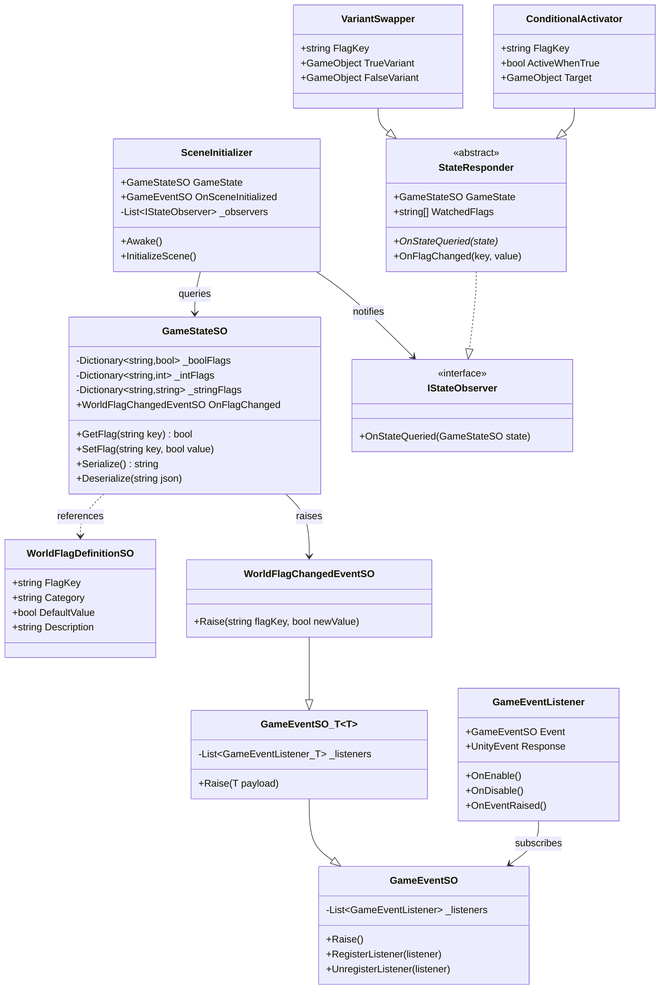
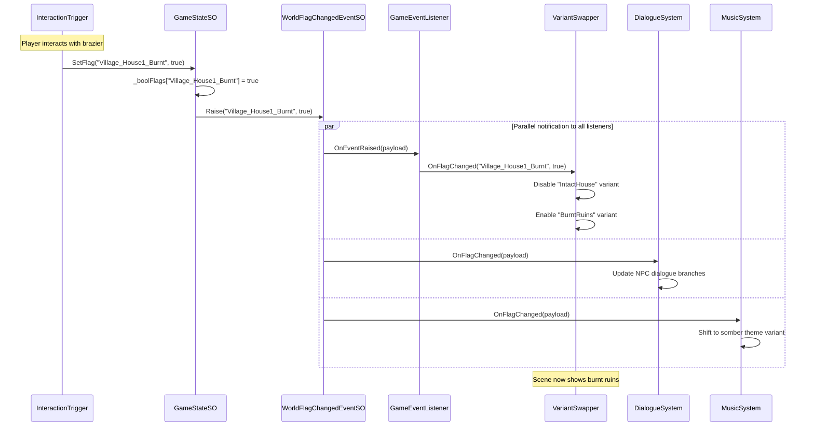

# Phase 1: The Nervous System - Technical Architecture

This plan defines the foundational systems for Greenlight's reactive world. All systems follow the `RetroAdventure.[Module]` namespace convention and Unity 6.3 URP 2D standards.

---

## File Structure

```
Assets/
├── _Greenlight/
│   ├── Scripts/
│   │   ├── Core/
│   │   │   ├── GlobalGameState/
│   │   │   │   ├── GameStateSO.cs              # Main state container
│   │   │   │   ├── WorldFlagDefinitionSO.cs    # Flag metadata (name, category, default)
│   │   │   │   ├── WorldFlagRegistry.cs        # Runtime flag lookup dictionary
│   │   │   │   └── StateSerializer.cs          # JSON serialization for saves
│   │   │   │
│   │   │   ├── Events/
│   │   │   │   ├── GameEventSO.cs              # Base parameterless event
│   │   │   │   ├── GameEventSO_T.cs            # Generic typed event (bool, int, string)
│   │   │   │   ├── WorldFlagChangedEventSO.cs  # Specific event for flag changes
│   │   │   │   ├── GameEventListener.cs        # MonoBehaviour listener component
│   │   │   │   └── GameEventListener_T.cs      # Generic typed listener
│   │   │   │
│   │   │   └── SceneManagement/
│   │   │       ├── SceneInitializer.cs         # Queries GGS on scene load
│   │   │       ├── StateResponder.cs           # Base class for reactive objects
│   │   │       ├── VariantSwapper.cs           # Enables/disables child variants
│   │   │       └── ConditionalActivator.cs     # Simple enable/disable based on flag
│   │   │
│   │   └── Interfaces/
│   │       ├── IStateObserver.cs               # Interface for state-reactive objects
│   │       └── ISerializableState.cs           # Interface for saveable components
│   │
│   ├── Data/
│   │   ├── GameState/
│   │   │   ├── MasterGameState.asset           # The singleton GameStateSO instance
│   │   │   └── Flags/
│   │   │       ├── World/                      # WorldFlagDefinitionSO assets
│   │   │       ├── Story/
│   │   │       └── Gadgets/
│   │   │
│   │   └── Events/
│   │       ├── OnWorldFlagChanged.asset        # WorldFlagChangedEventSO instance
│   │       ├── OnSceneInitialized.asset        # Fired after scene setup complete
│   │       └── OnGameLoaded.asset              # Fired after save load
│   │
│   └── Editor/
│       ├── GameStateEditor.cs                  # Custom inspector for debugging
│       └── WorldFlagDefinitionEditor.cs        # Flag creation wizard
```

---

## Class Relationships



---

## Logic Flow: World State Change Propagation

**Scenario**: Player triggers event that burns down a house (`Village_House1_Burnt = true`)



---

## Data Serialization for Cross-Platform Cloud Saves

The `GameStateSO` uses a flat JSON structure optimized for portability:

```json
{
  "version": 1,
  "timestamp": "2026-01-25T14:30:00Z",
  "boolFlags": {
    "Village_House1_Burnt": true,
    "ForestShrine_Cleansed": false,
    "Gadget_Grapple_Acquired": true
  },
  "intFlags": {
    "Player_MaxHealth": 6,
    "Player_Luni": 245
  },
  "stringFlags": {
    "Player_LastCheckpoint": "Village_Square"
  }
}
```

**Key design decisions for cloud saves:**

- Flat dictionary structure (no nested objects) for easy diff/merge
- Version field for migration compatibility
- String keys allow runtime flag creation without recompilation
- Platform-agnostic: uses `System.Text.Json` or Unity's `JsonUtility`

---

## Hot-Reloading Support (Editor Testing)

The Event Bus supports live testing without recompiles:

1. **ScriptableObject Events persist through Play Mode**: Changes to `GameStateSO` in Play Mode can be inspected in real-time via custom inspector.

2. **Runtime Flag Injection**: The `GameStateEditor.cs` provides a debug panel to:

   - View all current flags and values
   - Toggle any bool flag with a single click
   - Manually fire `WorldFlagChangedEventSO` with custom payloads

3. **Scene Re-initialization**: A debug button calls `SceneInitializer.InitializeScene()` to re-query all `IStateObserver` objects without reloading the scene.

---

## Integration Points for Future Phases

| Future System | Integration Hook |

|---------------|------------------|

| **Gadget System (Phase 2)** | `SetFlag("Gadget_[Name]_Acquired", true)` triggers unlock events |

| **Dialogue System (Phase 2)** | Subscribes to `OnWorldFlagChanged` for conditional branches |

| **Save/Load UI** | Calls `GameStateSO.Serialize()` / `Deserialize()` |

| **Combat (Phase 3)** | Queries `GameStateSO` for enemy spawn variants |

| **Music (Phase 4)** | Subscribes to flag changes for dynamic theme switching |

---

## Implementation Order

The recommended implementation sequence ensures each piece can be tested before building dependent systems.