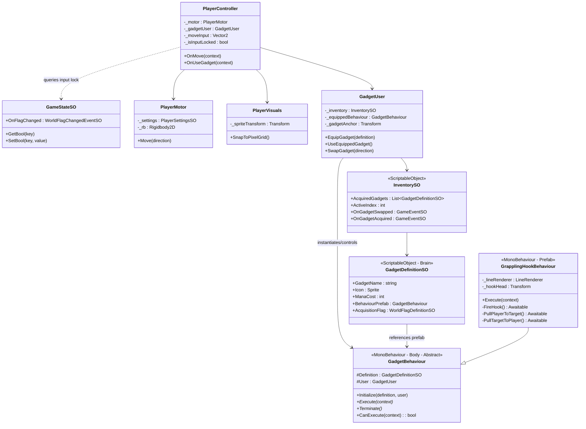
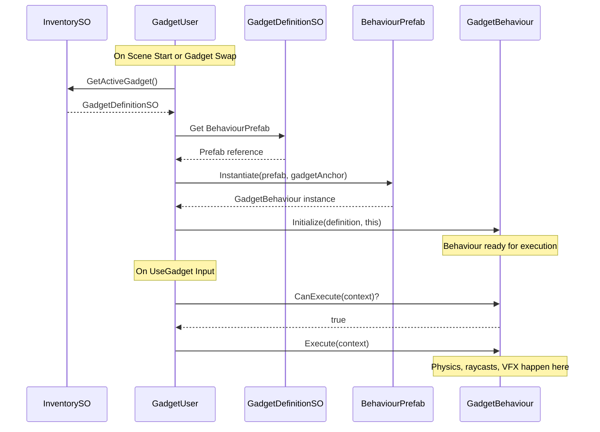
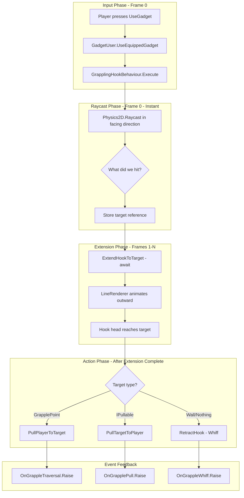

# Phase 2: The Vocabulary (Core Mechanics) Implementation Plan

This plan implements the three pillars of Phase 2 from the roadmap: a responsive character controller, a modular gadget framework using **Data + Behavior pairs**, and the grappling hook as the "first verb."

---

## Core Design Philosophy: Data + Behavior Pairs

Per the Architectural Intent in PROJECT_VISION.md, gadgets follow a strict separation:

| Layer | Type | Role | Pillar Alignment |

|-------|------|------|------------------|

| **Brain** (Definition) | `ScriptableObject` | Holds grammar data: Name, Icon, Mana Cost, Prefab reference | "Gadgets as Grammar" - designers create variants without code |

| **Body** (Behaviour) | `MonoBehaviour` on Prefab | Handles physics, collisions, VFX, scene interactions | "Combat as Conversation" - snappy mechanical feel |

This enables:

- **Designer Workflow**: Create 10 arrow variants by duplicating a ScriptableObject and tweaking values
- **Engine Workflow**: Physics/VFX handled by instantiated prefabs with direct Transform/Rigidbody2D access
- **No Bloat**: Data assets are cheap; complex prefabs only instantiated when needed

---

## Architecture Overview



---

## 1. Responsive Character Controller

### File Structure

```
Assets/_Greenlight/Scripts/
├── Player/
│   ├── PlayerController.cs      # Input routing + state orchestration
│   ├── PlayerMotor.cs           # Physics-based movement (32 PPU)
│   ├── PlayerSettingsSO.cs      # Tunable movement constants
│   ├── PlayerVisuals.cs         # LateUpdate pixel snapping
│   ├── InputLockResponder.cs    # Listens for System_Input_Locked
│   └── Greenlight.Player.asmdef
└── Data/
    └── Player/
        └── DefaultPlayerSettings.asset
```

### Key Technical Decisions

| Concern | Approach |

|---------|----------|

| Movement Physics | Use `Rigidbody2D` in **Kinematic** mode with manual `MovePosition()`. Avoid velocity-based movement to prevent slippery drift. |

| Pixel Snapping | Round positions to 1/32 (PPU) in `LateUpdate` via `PlayerVisuals`. |

| Input Lock | Watch `System_Input_Locked` flag via `StateResponder` pattern. When locked, zero out `_moveInput`. |

| Cross-Platform | Input System already supports Gamepad, Keyboard, and Touch control schemes. Use Unity's On-Screen Controls for Android virtual joystick. |

| Facing Direction | Track last non-zero move direction for gadget aiming. |

### PlayerMotor Movement Formula

Movement speed should be expressed in **pixels per second** then converted:

```csharp
// In PlayerSettingsSO
[Header("Movement (32 PPU)")]
public float MoveSpeedPixelsPerSecond = 96f; // 3 tiles/sec at 32 PPU

// Computed property for physics
public float MoveSpeedUnits => MoveSpeedPixelsPerSecond / 32f; // 3.0 units/sec
```

### PlayerVisuals Pixel Snapping

```csharp
// In PlayerVisuals.LateUpdate()
private void LateUpdate()
{
    // Snap visual position to pixel grid (1/32 unit = 1 pixel)
    Vector3 pos = _spriteTransform.position;
    pos.x = Mathf.Round(pos.x * 32f) / 32f;
    pos.y = Mathf.Round(pos.y * 32f) / 32f;
    _spriteTransform.position = pos;
}
```

---

## 2. Modular Gadget Framework (Data + Behavior Pairs)

### File Structure

```
Assets/_Greenlight/Scripts/
├── Gadgets/
│   ├── Data/
│   │   ├── GadgetDefinitionSO.cs    # ScriptableObject "Brain"
│   │   └── InventorySO.cs           # Gadget collection + active slot
│   ├── Behaviours/
│   │   ├── GadgetBehaviour.cs       # Abstract MonoBehaviour "Body"
│   │   └── GrapplingHookBehaviour.cs
│   ├── Runtime/
│   │   ├── GadgetUser.cs            # Equips and executes gadgets
│   │   └── GadgetExecutionContext.cs
│   └── Greenlight.Gadgets.asmdef
├── Data/
│   └── Gadgets/
│       ├── Definitions/
│       │   └── GrapplingHook.asset  # GadgetDefinitionSO
│       └── PlayerInventory.asset    # InventorySO
└── Prefabs/
    └── Gadgets/
        └── GrapplingHook.prefab     # Has GrapplingHookBehaviour
```

### Data Flow: Equip and Execute



### GadgetDefinitionSO (The Brain)

```csharp
namespace Greenlight.Gadgets
{
    /// <summary>
    /// ScriptableObject definition for a gadget - the "Brain" that holds data.
    /// Designers create these assets to define new gadgets without code.
    /// </summary>
    [CreateAssetMenu(fileName = "NewGadget", menuName = "Greenlight/Gadgets/Gadget Definition")]
    public class GadgetDefinitionSO : ScriptableObject
    {
        [Header("Identity")]
        [SerializeField] private string _gadgetName;
        [SerializeField] private Sprite _icon;
        [SerializeField, TextArea] private string _description;

        [Header("Cost")]
        [SerializeField] private int _manaCost;

        [Header("Behaviour")]
        [SerializeField, Tooltip("Prefab containing the GadgetBehaviour component.")]
        private GadgetBehaviour _behaviourPrefab;

        [Header("State Integration")]
        [SerializeField, Tooltip("Flag set when player acquires this gadget.")]
        private WorldFlagDefinitionSO _acquisitionFlag;

        // Public accessors
        public string GadgetName => _gadgetName;
        public Sprite Icon => _icon;
        public string Description => _description;
        public int ManaCost => _manaCost;
        public GadgetBehaviour BehaviourPrefab => _behaviourPrefab;
        public WorldFlagDefinitionSO AcquisitionFlag => _acquisitionFlag;
    }
}
```

### GadgetBehaviour (The Body)

```csharp
namespace Greenlight.Gadgets
{
    /// <summary>
    /// Abstract base class for gadget behaviours - the "Body" that handles execution.
    /// Lives on a prefab, instantiated by GadgetUser when equipped.
    /// </summary>
    public abstract class GadgetBehaviour : MonoBehaviour
    {
        protected GadgetDefinitionSO Definition { get; private set; }
        protected GadgetUser User { get; private set; }
        protected bool IsExecuting { get; set; }

        /// <summary>
        /// Called by GadgetUser after instantiation.
        /// </summary>
        public virtual void Initialize(GadgetDefinitionSO definition, GadgetUser user)
        {
            Definition = definition;
            User = user;
        }

        /// <summary>
        /// Check if the gadget can currently be used.
        /// Override to add mana checks, cooldowns, etc.
        /// </summary>
        public virtual bool CanExecute(GadgetExecutionContext context)
        {
            return !IsExecuting;
        }

        /// <summary>
        /// Execute the gadget's primary action.
        /// Override to implement gadget-specific logic.
        /// </summary>
        public abstract void Execute(GadgetExecutionContext context);

        /// <summary>
        /// Called when gadget is unequipped or player swaps away.
        /// Override to clean up VFX, cancel async operations, etc.
        /// </summary>
        public virtual void Terminate()
        {
            IsExecuting = false;
        }
    }
}
```

### GadgetExecutionContext

```csharp
namespace Greenlight.Gadgets
{
    /// <summary>
    /// Context passed to GadgetBehaviour.Execute() containing
    /// all information needed to perform the gadget action.
    /// </summary>
    public struct GadgetExecutionContext
    {
        /// <summary>Position of the user when gadget was activated.</summary>
        public Vector2 UserPosition;

        /// <summary>Direction the user is facing (for aiming).</summary>
        public Vector2 FacingDirection;

        /// <summary>Reference to the user's Transform for movement gadgets.</summary>
        public Transform UserTransform;

        /// <summary>Reference to the user's Rigidbody2D if physics needed.</summary>
        public Rigidbody2D UserRigidbody;
    }
}
```

### InventorySO Definition

```csharp
namespace Greenlight.Gadgets
{
    /// <summary>
    /// Tracks which gadgets the player has acquired and which is active.
    /// </summary>
    [CreateAssetMenu(fileName = "PlayerInventory", menuName = "Greenlight/Player/Inventory")]
    public class InventorySO : ScriptableObject
    {
        [Header("Gadgets")]
        [SerializeField] private List<GadgetDefinitionSO> _acquiredGadgets = new();
        [SerializeField] private int _activeIndex;

        [Header("Events")]
        [SerializeField] private GameEventSO _onGadgetSwapped;
        [SerializeField] private GameEventSO _onGadgetAcquired;

        public IReadOnlyList<GadgetDefinitionSO> AcquiredGadgets => _acquiredGadgets;
        public int ActiveIndex => _activeIndex;
        public GameEventSO OnGadgetSwapped => _onGadgetSwapped;
        public GameEventSO OnGadgetAcquired => _onGadgetAcquired;

        public GadgetDefinitionSO ActiveGadget =>
            _acquiredGadgets.Count > 0 && _activeIndex < _acquiredGadgets.Count
                ? _acquiredGadgets[_activeIndex]
                : null;

        public void CycleNext()
        {
            if (_acquiredGadgets.Count <= 1) return;
            _activeIndex = (_activeIndex + 1) % _acquiredGadgets.Count;
            _onGadgetSwapped?.Raise();
        }

        public void CyclePrevious()
        {
            if (_acquiredGadgets.Count <= 1) return;
            _activeIndex = (_activeIndex - 1 + _acquiredGadgets.Count) % _acquiredGadgets.Count;
            _onGadgetSwapped?.Raise();
        }

        public void AcquireGadget(GadgetDefinitionSO gadget)
        {
            if (!_acquiredGadgets.Contains(gadget))
            {
                _acquiredGadgets.Add(gadget);
                _onGadgetAcquired?.Raise();
            }
        }

#if UNITY_EDITOR
        private void OnEnable()
        {
            // Prevent play mode state pollution
            if (!Application.isPlaying)
            {
                _activeIndex = 0;
            }
        }
#endif
    }
}
```

---

## 3. The First Verb: Grappling Hook

### Behavior Specification

| Property | Value | Notes |

|----------|-------|-------|

| Hook Speed | 384 pixels/sec (12 tiles/sec) | Fast, snappy feel |

| Max Distance | 160 pixels (5 tiles) | Reasonable range for puzzles |

| Pull Speed | 256 pixels/sec (8 tiles/sec) | Slightly slower than hook travel |

| Aim Direction | Player's facing direction | Auto-aim, retro-style |

| Valid Targets | `GrapplePoint` component, `IPullable` interface | Layer-filtered raycast |

| Combat Pull | Enemies with `IPullable` yanked toward player | Sets up combos |

### Execution Phases (Critical Timing)

The grappling hook has **three distinct phases** to ensure proper visual feedback:

| Phase | Duration | What Happens | Player State |

|-------|----------|--------------|--------------|

| **1. Extension** | ~0.4s (distance / hookSpeed) | Hook head travels to target, LineRenderer extends | Frozen in place |

| **2. Action** | ~0.6s (distance / pullSpeed) | Player pulled OR enemy pulled | Moving |

| **3. Retraction** | ~0.2s (on whiff only) | Hook returns to player | Frozen |

**Critical Rule**: The raycast determines the outcome instantly (frame 0), but the player must NOT move until Phase 1 completes. The hook must visually reach the target first!

### Interaction Layers



### GrapplingHookBehaviour Implementation

```csharp
namespace Greenlight.Gadgets
{
    /// <summary>
    /// The Grappling Hook - first verb implementation.
    /// Traversal: Pull player to GrapplePoints
    /// Combat: Pull IPullable enemies toward player
    /// 
    /// CRITICAL TIMING: Hook must visually extend BEFORE player/enemy moves!
    /// Phase 1: ExtendHookToTarget (visual only)
    /// Phase 2: Action (PullPlayer or PullEnemy)
    /// Phase 3: Retract (on whiff)
    /// </summary>
    [AddComponentMenu("Greenlight/Gadgets/Grappling Hook Behaviour")]
    public class GrapplingHookBehaviour : GadgetBehaviour
    {
        [Header("Hook Settings (32 PPU)")]
        [SerializeField] private float _hookSpeedPixels = 384f;  // 12 tiles/sec - extension speed
        [SerializeField] private float _maxDistancePixels = 160f; // 5 tiles
        [SerializeField] private float _pullSpeedPixels = 256f;   // 8 tiles/sec - player/enemy movement

        [Header("Physics")]
        [SerializeField] private LayerMask _grappleableLayers;
        [SerializeField] private ContactFilter2D _contactFilter;

        [Header("Visuals")]
        [SerializeField] private LineRenderer _lineRenderer;
        [SerializeField] private Transform _hookHead;

        [Header("Events")]
        [SerializeField] private GameEventSO _onTraversal;
        [SerializeField] private GameEventSO _onPull;
        [SerializeField] private GameEventSO _onWhiff;

        // Convert to units
        private float HookSpeedUnits => _hookSpeedPixels / 32f;
        private float MaxDistanceUnits => _maxDistancePixels / 32f;
        private float PullSpeedUnits => _pullSpeedPixels / 32f;

        public override async void Execute(GadgetExecutionContext context)
        {
            if (IsExecuting) return;
            IsExecuting = true;

            try
            {
                // ========== PHASE 0: RAYCAST (Instant - Frame 0) ==========
                // Determine outcome immediately, but DON'T act on it yet
                RaycastHit2D hit = Physics2D.Raycast(
                    context.UserPosition,
                    context.FacingDirection,
                    MaxDistanceUnits,
                    _grappleableLayers
                );

                // Calculate visual target point
                Vector2 visualTarget = hit.collider != null
                    ? hit.point
                    : context.UserPosition + context.FacingDirection * MaxDistanceUnits;

                // ========== PHASE 1: EXTENSION (Visual - Must complete first!) ==========
                // Player sees the hook fly out BEFORE anything else happens
                await ExtendHookToTarget(context.UserPosition, visualTarget);

                // ========== PHASE 2: ACTION (After hook reaches target) ==========
                if (hit.collider != null)
                {
                    if (hit.collider.TryGetComponent<GrapplePoint>(out var grapplePoint))
                    {
                        // Hook latched! Now pull the player
                        await PullPlayerToTarget(context, grapplePoint);
                        _onTraversal?.Raise();
                    }
                    else if (hit.collider.TryGetComponent<IPullable>(out var pullable))
                    {
                        // Hook latched to enemy! Pull them toward us
                        await PullTargetToPlayer(context, pullable);
                        _onPull?.Raise();
                    }
                    else
                    {
                        // Hit a wall or non-grappleable - retract
                        await RetractHook(context.UserPosition);
                        _onWhiff?.Raise();
                    }
                }
                else
                {
                    // ========== PHASE 3: RETRACTION (Whiff) ==========
                    // Nothing hit - hook returns
                    await RetractHook(context.UserPosition);
                    _onWhiff?.Raise();
                }
            }
            finally
            {
                IsExecuting = false;
                _lineRenderer.enabled = false;
            }
        }

        /// <summary>
        /// Phase 1: Animate hook head traveling from player to target.
        /// LineRenderer extends visually. Player does NOT move yet.
        /// </summary>
        private async Awaitable ExtendHookToTarget(Vector2 origin, Vector2 target)
        {
            _lineRenderer.enabled = true;
            _lineRenderer.positionCount = 2;

            float distance = Vector2.Distance(origin, target);
            float duration = distance / HookSpeedUnits;
            float elapsed = 0f;

            while (elapsed < duration)
            {
                elapsed += Time.deltaTime;
                float t = Mathf.Clamp01(elapsed / duration);

                // Lerp hook head position
                Vector2 currentHookPos = Vector2.Lerp(origin, target, t);
                _hookHead.position = currentHookPos;

                // Update line renderer
                _lineRenderer.SetPosition(0, origin);
                _lineRenderer.SetPosition(1, currentHookPos);

                await Awaitable.NextFrameAsync(destroyCancellationToken);
            }

            // Snap to final position
            _hookHead.position = target;
            _lineRenderer.SetPosition(1, target);
        }

        /// <summary>
        /// Phase 2a: Pull player toward the grapple point.
        /// Called AFTER ExtendHookToTarget completes.
        /// </summary>
        private async Awaitable PullPlayerToTarget(GadgetExecutionContext context, GrapplePoint target)
        {
            Vector2 targetPos = (Vector2)target.transform.position + target.LandingOffset;
            Vector2 startPos = context.UserPosition;

            float distance = Vector2.Distance(startPos, targetPos);
            float duration = distance / PullSpeedUnits;
            float elapsed = 0f;

            while (elapsed < duration)
            {
                elapsed += Time.deltaTime;
                float t = Mathf.Clamp01(elapsed / duration);

                // Move player toward target
                Vector2 newPos = Vector2.Lerp(startPos, targetPos, t);
                context.UserRigidbody.MovePosition(newPos);

                // Keep line attached
                _lineRenderer.SetPosition(0, newPos);

                await Awaitable.NextFrameAsync(destroyCancellationToken);
            }

            // Snap to landing position
            context.UserRigidbody.MovePosition(targetPos);
        }

        /// <summary>
        /// Phase 2b: Pull enemy toward the player.
        /// Called AFTER ExtendHookToTarget completes.
        /// </summary>
        private async Awaitable PullTargetToPlayer(GadgetExecutionContext context, IPullable target)
        {
            target.PullToward(context.UserPosition, PullSpeedUnits);
            // Enemy handles its own movement; we just wait for completion
            // LineRenderer follows the enemy position during pull
            await Awaitable.WaitForSecondsAsync(0.5f, destroyCancellationToken); // Or listen for OnPullComplete
            target.OnPullComplete();
        }

        /// <summary>
        /// Phase 3: Retract hook back to player (whiff case).
        /// </summary>
        private async Awaitable RetractHook(Vector2 playerPos)
        {
            Vector2 hookPos = _hookHead.position;
            float distance = Vector2.Distance(hookPos, playerPos);
            float duration = distance / HookSpeedUnits;
            float elapsed = 0f;

            while (elapsed < duration)
            {
                elapsed += Time.deltaTime;
                float t = Mathf.Clamp01(elapsed / duration);

                Vector2 currentPos = Vector2.Lerp(hookPos, playerPos, t);
                _hookHead.position = currentPos;
                _lineRenderer.SetPosition(1, currentPos);

                await Awaitable.NextFrameAsync(destroyCancellationToken);
            }
        }

        public override void Terminate()
        {
            base.Terminate();
            _lineRenderer.enabled = false;
        }
    }
}
```

### GrapplePoint Component

```csharp
namespace Greenlight.Environment
{
    /// <summary>
    /// Marker component for environment points the grappling hook can attach to.
    /// </summary>
    [AddComponentMenu("Greenlight/Environment/Grapple Point")]
    public class GrapplePoint : MonoBehaviour
    {
        [Tooltip("Offset from transform position where player lands after grappling.")]
        [SerializeField] private Vector2 _landingOffset;

        public Vector2 LandingOffset => _landingOffset;

#if UNITY_EDITOR
        private void OnDrawGizmos()
        {
            Gizmos.color = new Color(0f, 1f, 1f, 0.5f);
            Gizmos.DrawWireSphere(transform.position, 0.25f);
        }

        private void OnDrawGizmosSelected()
        {
            Gizmos.color = Color.cyan;
            Gizmos.DrawWireSphere(transform.position, 0.5f);
            Vector3 landingPos = transform.position + (Vector3)_landingOffset;
            Gizmos.DrawLine(transform.position, landingPos);
            Gizmos.DrawWireSphere(landingPos, 0.15f);
        }
#endif
    }
}
```

### IPullable Interface

```csharp
namespace Greenlight.Gadgets
{
    /// <summary>
    /// Interface for objects that can be pulled by the grappling hook.
    /// Implement on enemies or physics objects.
    /// </summary>
    public interface IPullable
    {
        /// <summary>Pull this object toward the specified position.</summary>
        void PullToward(Vector2 targetPosition, float speed);

        /// <summary>Called when the pull completes or is interrupted.</summary>
        void OnPullComplete();
    }
}
```

---

## 4. Event Channels for Decoupling

Create these SO-based events in `Assets/_Greenlight/Data/Events/Gadgets/`:

| Event Asset | Type | Listeners |

|-------------|------|-----------|

| `OnGadgetUsed.asset` | `GameEventSO` | UI (cooldown indicator), Audio (use SFX) |

| `OnGadgetSwapped.asset` | `GameEventSO` | UI (highlight update), Audio (click SFX) |

| `OnGadgetAcquired.asset` | `GameEventSO` | UI (unlock fanfare), GameState (set flag) |

| `OnGrappleTraversal.asset` | `GameEventSO` | Camera (follow), VFX (trail), Audio (woosh) |

| `OnGrapplePull.asset` | `GameEventSO` | Audio (impact), VFX (enemy stagger) |

| `OnGrappleWhiff.asset` | `GameEventSO` | Audio (whiff sound) |

---

## 5. Complete File Structure

```
Assets/_Greenlight/
├── Scripts/
│   ├── Player/
│   │   ├── PlayerController.cs
│   │   ├── PlayerMotor.cs
│   │   ├── PlayerSettingsSO.cs
│   │   ├── PlayerVisuals.cs
│   │   ├── InputLockResponder.cs
│   │   └── Greenlight.Player.asmdef
│   ├── Gadgets/
│   │   ├── Data/
│   │   │   ├── GadgetDefinitionSO.cs      # Brain
│   │   │   └── InventorySO.cs
│   │   ├── Behaviours/
│   │   │   ├── GadgetBehaviour.cs         # Body (abstract)
│   │   │   └── GrapplingHookBehaviour.cs
│   │   ├── Runtime/
│   │   │   ├── GadgetUser.cs
│   │   │   └── GadgetExecutionContext.cs
│   │   ├── Interfaces/
│   │   │   └── IPullable.cs
│   │   └── Greenlight.Gadgets.asmdef
│   └── Environment/
│       ├── GrapplePoint.cs
│       └── Greenlight.Environment.asmdef
├── Data/
│   ├── Player/
│   │   └── DefaultPlayerSettings.asset
│   ├── Gadgets/
│   │   ├── Definitions/
│   │   │   └── GrapplingHook.asset        # GadgetDefinitionSO
│   │   └── PlayerInventory.asset          # InventorySO
│   ├── Events/
│   │   ├── Gadgets/
│   │   │   ├── OnGadgetUsed.asset
│   │   │   ├── OnGadgetSwapped.asset
│   │   │   ├── OnGadgetAcquired.asset
│   │   │   ├── OnGrappleTraversal.asset
│   │   │   ├── OnGrapplePull.asset
│   │   │   └── OnGrappleWhiff.asset
│   │   └── (existing events)
│   └── Flags/
│       └── Gadgets/
│           └── Gadget_Grapple_Acquired.asset
└── Prefabs/
    ├── Player/
    │   └── Player.prefab
    └── Gadgets/
        └── GrapplingHook.prefab           # Has GrapplingHookBehaviour + LineRenderer
```

---

## 6. Integration with Existing Systems

### StateRegistry Integration

`PlayerController` should extend `StateResponder` to:

1. Register with `StateRegistry` on `OnEnable`
2. Watch `System_Input_Locked` flag - when true, ignore all input
3. Query `GameStateSO` for gadget acquisition flags

### Input System Mapping

Extend [InputSystem_Actions.inputactions](Assets/InputSystem_Actions.inputactions):

| Action | Binding | Purpose |

|--------|---------|---------|

| `UseGadget` | Gamepad West (X) / Mouse Left / Touch Tap | Primary gadget activation |

| `Previous` | Already exists (1 / DPad Left) | Cycle gadget backward |

| `Next` | Already exists (2 / DPad Right) | Cycle gadget forward |

### Assembly References

`Greenlight.Player.asmdef` should reference:

- `Greenlight.Core`
- `Greenlight.Gadgets`
- `Unity.InputSystem`

`Greenlight.Gadgets.asmdef` should reference:

- `Greenlight.Core`

`Greenlight.Environment.asmdef` should reference:

- `Greenlight.Core`

---

## 7. 32 PPU Compliance Checklist

- [ ] `PlayerSettingsSO.MoveSpeedPixelsPerSecond` expressed in pixels (96 = 3 tiles/sec)
- [ ] `PlayerMotor` uses `Rigidbody2D.MovePosition()` not velocity
- [ ] `PlayerVisuals.LateUpdate()` snaps sprite to pixel grid (round to 1/32)
- [ ] `GrapplingHookBehaviour` speeds/distances defined in pixels, converted to units
- [ ] No `Time.deltaTime` drift accumulation - use fixed increments where possible
- [ ] All LayerMasks configured to filter appropriately

---

## 8. Implementation Order

1. **PlayerSettingsSO** - establish movement constants in pixel units
2. **PlayerMotor** - kinematic Rigidbody2D with MovePosition
3. **PlayerVisuals** - pixel snapping in LateUpdate
4. **PlayerController** - wire Input System callbacks, integrate Motor
5. **InputLockResponder** - extend StateResponder for input locking
6. **GadgetDefinitionSO** - ScriptableObject "Brain"
7. **GadgetBehaviour** - abstract MonoBehaviour "Body"
8. **InventorySO** - gadget collection management
9. **GadgetUser** - equip/execute runtime
10. **GrapplingHookBehaviour** - first verb prefab implementation
11. **GrapplePoint** - environment markers
12. **Event assets** - create all gadget event channels
13. **Input actions** - add UseGadget to input asset
14. **Documentation** - create phase2-vocabulary.md

---

## 9. Designer Workflow Summary

### Creating a New Gadget

1. **Create Definition Asset**:

   - Right-click in `Assets/_Greenlight/Data/Gadgets/Definitions/`
   - Create > Greenlight > Gadgets > Gadget Definition
   - Name it (e.g., `Lantern.asset`)
   - Fill in Name, Icon, Mana Cost, Description

2. **Create Behaviour Prefab** (or reuse existing):

   - Create prefab in `Assets/_Greenlight/Prefabs/Gadgets/`
   - Add appropriate `GadgetBehaviour` subclass component
   - Add VFX, audio sources, colliders as needed

3. **Link Definition to Behaviour**:

   - Select the Definition asset
   - Drag the Behaviour prefab into the "Behaviour Prefab" slot

4. **Add to Inventory** (for testing):

   - Open `PlayerInventory.asset`
   - Add the new Definition to the Acquired Gadgets list

No code required for data-driven variants!