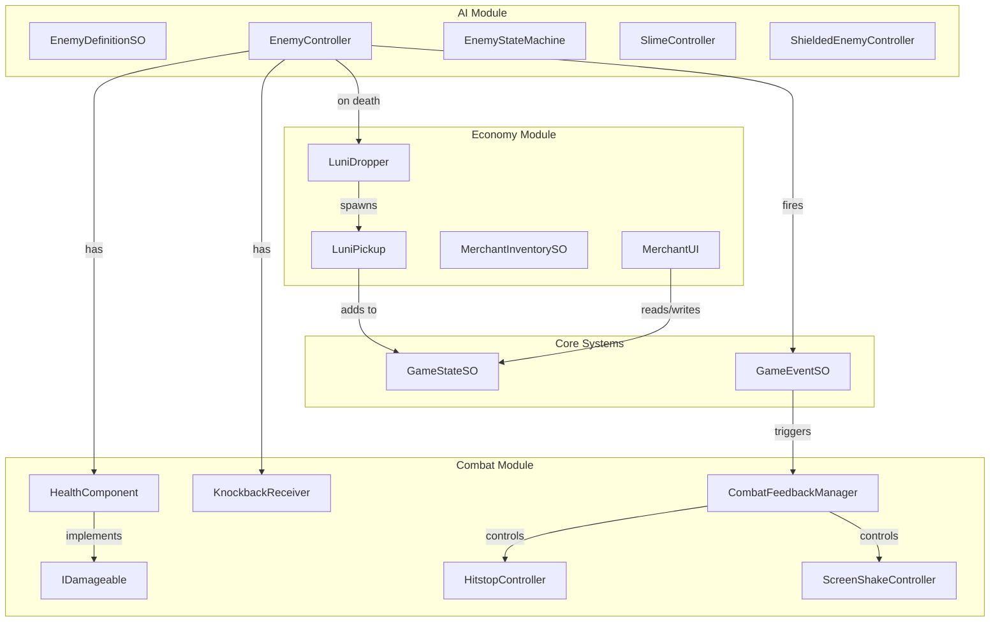
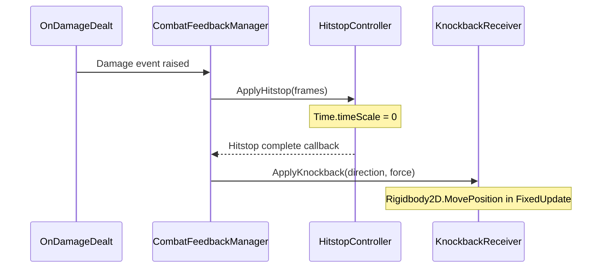
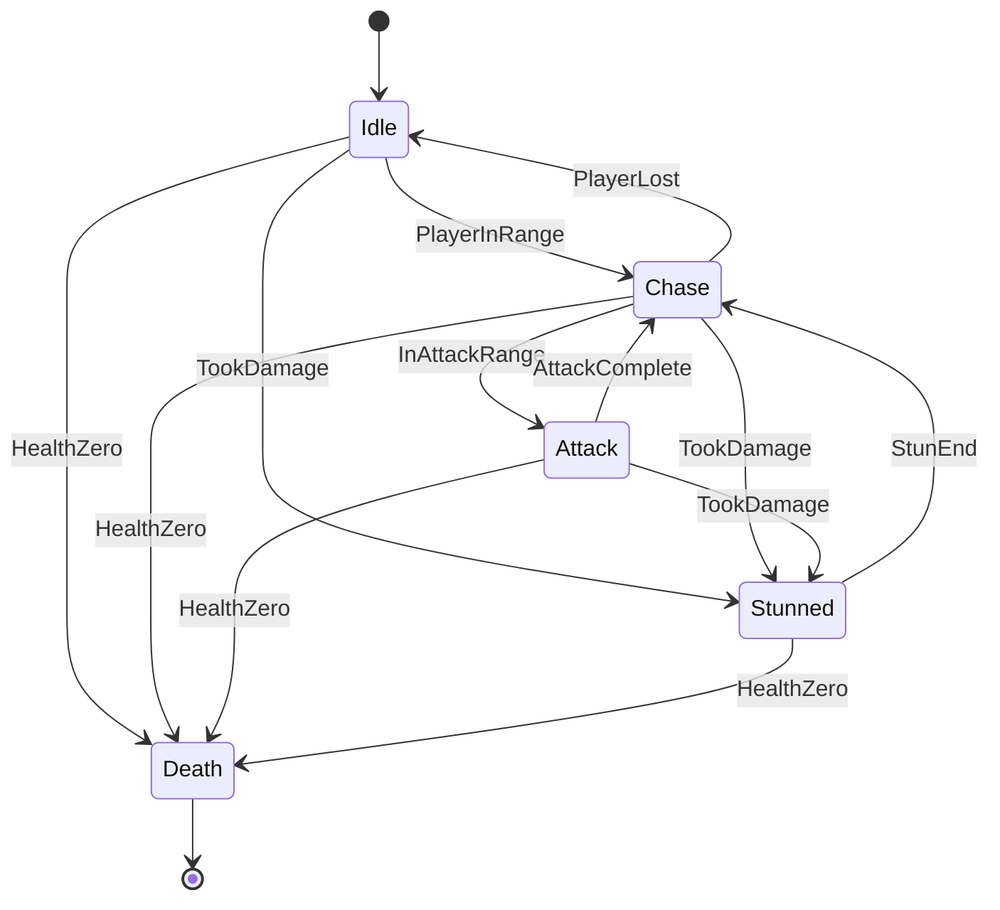
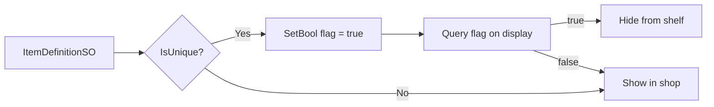

# Phase 3: The "Conversation" - Combat & AI Implementation

This plan implements Phase 3 of the Greenlight roadmap, focusing on tactical combat, enemy AI, combat feedback polish, and the Luni economy loop.

---

## Pillar Audit Compliance

This plan has been audited against Greenlight's core pillars:

| Pillar | Status | Key Safeguard |

|--------|--------|---------------|

| Combat as Conversation | Pass | Enemies telegraph attacks with distinct visual (squash/stretch) AND audio cues |

| Gadgets as Grammar | High Pass | Shielded Guardian requires grapple hook; pull triggers "shield rip" into Stunned |

| A World That Remembers | Pass | Unique shop items track `Purchased` flags; merchants remember transactions |

| No Grinding | Pass | Generous 100% drop rates; room clears provide natural progression currency |

---

## Architecture Overview



---

## Phase 3.1: Combat Foundation

### New Assembly: `Greenlight.Combat`

Create [`Assets/_Greenlight/Scripts/Combat/Greenlight.Combat.asmdef`](Assets/_Greenlight/Scripts/Combat/Greenlight.Combat.asmdef) with references to `Greenlight.Core`.

### Core Interfaces and Components

| File | Purpose |

|------|---------|

| `Combat/Interfaces/IDamageable.cs` | Interface for anything that can take damage |

| `Combat/Data/CombatSettingsSO.cs` | Tunable values: iframes duration, knockback force, hitstop frames |

| `Combat/Runtime/HealthComponent.cs` | Heart-based health with max/current, integrates with GameState events |

| `Combat/Runtime/KnockbackReceiver.cs` | Applies knockback velocity with pixel-perfect movement |

| `Combat/Runtime/InvincibilityController.cs` | Manages iframes with visual flicker |

### Combat Events (ScriptableObject channels)

Create in `Data/Events/Combat/`:

- `OnDamageDealt.asset` - Payload: attacker, target, damage amount
- `OnEntityDefeated.asset` - Payload: defeated entity, killer
- `OnPlayerHurt.asset` - For UI/audio to react
- `OnHealthChanged.asset` - For HUD hearts display

---

## Phase 3.2: Combat Feedback System

### Components

| File | Purpose |

|------|---------|

| `Combat/Feedback/CombatFeedbackManager.cs` | Listens to combat events, orchestrates feedback |

| `Combat/Feedback/HitstopController.cs` | Pauses `Time.timeScale` for N frames on impact |

| `Combat/Feedback/ScreenShakeController.cs` | Cinemachine Impulse or manual camera shake |

| `Combat/Data/CombatFeedbackSettingsSO.cs` | Hitstop duration, shake intensity per damage tier |

### Key Design: Hitstop + Knockback Sequencing

**Critical Architecture Note**: When `Time.timeScale = 0`, physics behaves unpredictably. Knockback must apply AFTER hitstop concludes to prevent "slippery" impact feel.


```csharp
// CombatFeedbackManager orchestrates the sequence
public async void OnDamageDealt(DamagePayload payload)
{
    // 1. Apply hitstop FIRST (freezes everything)
    await _hitstopController.ApplyHitstopAsync(_settings.HitstopFrames);
    
    // 2. Apply knockback AFTER (so it actually moves)
    if (payload.Target.TryGetComponent<KnockbackReceiver>(out var kb))
    {
        Vector2 knockbackDir = (payload.Target.position - payload.Attacker.position).normalized;
        kb.ApplyKnockback(knockbackDir, _settings.KnockbackForce);
    }
    
    // 3. Trigger screenshake (concurrent with knockback)
    _screenShakeController.Shake(_settings.ShakeIntensity);
}
```

**KnockbackReceiver** uses `Rigidbody2D.MovePosition()` in `FixedUpdate` to respect pixel-perfect movement (32 PPU). Knockback velocity decays over a fixed duration, not distance.

---

## Phase 3.3: Enemy AI Framework

### New Assembly: `Greenlight.AI`

Create [`Assets/_Greenlight/Scripts/AI/Greenlight.AI.asmdef`](Assets/_Greenlight/Scripts/AI/Greenlight.AI.asmdef) with references to `Greenlight.Core`, `Greenlight.Combat`, `Greenlight.Gadgets`.

### Data-Driven Enemy Definitions

| File | Purpose |

|------|---------|

| `AI/Data/EnemyDefinitionSO.cs` | ScriptableObject: health, speed, damage, Luni drop range, behavior prefab reference |

| `AI/Data/EnemyBehaviorSettingsSO.cs` | AI-specific: detection range, attack cooldown, telegraph duration |

### State Machine Architecture



| File | Purpose |

|------|---------|

| `AI/StateMachine/EnemyState.cs` | Abstract base state with Enter/Execute/Exit |

| `AI/StateMachine/EnemyStateMachine.cs` | Manages state transitions |

| `AI/StateMachine/States/IdleState.cs` | Patrols or waits, detects player |

| `AI/StateMachine/States/ChaseState.cs` | Pursues player with pathfinding |

| `AI/StateMachine/States/AttackState.cs` | Executes attack with telegraph |

| `AI/StateMachine/States/StunnedState.cs` | Frozen after taking damage (grapple pull ends here) |

| `AI/StateMachine/States/DeathState.cs` | Plays death animation, drops Luni |

### Enemy Telegraph System (Combat as Conversation)

Every enemy attack MUST "speak" before striking. The player should never feel ambushed by an attack they couldn't see coming.

| File | Purpose |

|------|---------|

| `AI/Runtime/EnemyTelegraph.cs` | Manages visual + audio telegraph cues |

| `AI/Data/TelegraphSettingsSO.cs` | Duration, animation curve, audio clip reference |

**Telegraph Components:**

- **Visual**: `EnemyVisuals.PlayTelegraph()` triggers squash/stretch animation or color flash
- **Audio**: `OnTelegraphStart` event fires for SFX (charging sound, growl, etc.)
- **Timing**: Telegraph duration is data-driven per enemy type (Slime = 0.8s, Guardian = 0.5s)

### Concrete Enemy Types

**1. Slime (Melee Charger) - "The Introduction"**

- `AI/Enemies/SlimeController.cs`
- **Purpose**: Teaches player timing and dodge fundamentals

| Phase | Duration | Visual | Audio |

|-------|----------|--------|-------|

| Idle | -- | Gentle wobble animation | Ambient squelch |

| Telegraph | 0.8s | Squash flat + vibrate + red tint | Rising "boing" charge-up |

| Charge | 0.5s | Stretched horizontally, fast move | Whoosh SFX |

| Recovery | 1.2s | Dizzy stars, vulnerable | Deflate "pffft" |

- **Weakness**: Side-step the charge, attack during Recovery state
- **Design Intent**: Clear, readable attack pattern. The player learns "red flash = dodge NOW"

**2. Shielded Guardian (Pullable) - "The Grammar Lesson"**

- `AI/Enemies/ShieldedEnemyController.cs`
- **Purpose**: Teaches that gadgets solve combat problems, not just traversal

| Phase | Behavior | Visual | Audio |

|-------|----------|--------|-------|

| Guarding | Faces player, shield blocks frontal damage | Shield glints, feet planted | Metal clank on blocked hits |

| Pulled | `IPullable.PullToward()` active | Shield RIPS away, spins toward player | Metallic scrape + grunt |

| Stunned | Vulnerable, back exposed | Dizzy stars, no shield | Dazed moan |

| Recovery | Picks up shield, returns to Guarding | Reaches for shield | Armor clatter |

**Critical: The "Shield Rip" Moment**

When grapple hook connects:

1. `GrapplingHookBehaviour` calls `IPullable.PullToward()`
2. `ShieldedEnemyController.PullToward()` triggers:

   - Shield sprite detaches (becomes separate physics object briefly)
   - Enemy rotation toward player (feels like being yanked)
   - State machine forces `StunnedState`

3. `OnPullComplete()` plays "thud" impact and enables damage window

This must feel HEAVY. The hook doesn't politely ask the shield to move; it RIPS it away.

---

## Phase 3.4: Economy Loop (Luni System)

### No Grinding Philosophy

**Design Principle**: Clearing a room ONCE provides enough Luni for progression. No farming respawns.

| Enemy Type | Luni Drop | Rationale |

|------------|-----------|-----------|

| Slime | 5-8 (guaranteed) | Common, always rewarding |

| Shielded Guardian | 15-20 (guaranteed) | Skill-gated, higher payout |

| Mini-boss (future) | 50-75 (guaranteed) | Room clear bonus |

**Drop Chance = 100%** for all enemies. Variance is in amount, not existence. No enemy kill should feel wasted.

### Currency Storage

Luni stored in `GameStateSO` as integer flag: `Player_Luni`

### Components

| File | Purpose |

|------|---------|

| `Economy/Data/LuniDropTableSO.cs` | Min/max Luni (always drops), visual prefab |

| `Economy/Runtime/LuniDropper.cs` | Spawns pickups on enemy death |

| `Economy/Runtime/LuniPickup.cs` | Magnet toward player, adds to GameState |

| `Economy/Data/ItemDefinitionSO.cs` | name, icon, cost, `IsUnique`, `PurchasedFlagRef` |

### Events

- `OnLuniCollected.asset` - For UI/audio feedback
- `OnPurchaseComplete.asset` - Merchant transaction success

---

## Phase 3.5: Merchant System (A World That Remembers)

### Unique Item Tracking

**Critical**: Shop remembers purchases. Unique items (Heart Container, Golden Gear) vanish permanently.



**Example**: Buy "Heart Container" -> `Item_HeartContainer_Purchased` = true -> Slot hidden next visit -> NPC can say "Enjoying that Heart Container?"

### Data Structures

| File | Purpose |

|------|---------|

| `Economy/Data/MerchantInventorySO.cs` | Item list, merchant ID |

| `Economy/Runtime/MerchantInteractable.cs` | Trigger zone, refs MerchantInventorySO |

### UI Architecture (MVC Pattern)

| Layer | Component | Responsibility |

|-------|-----------|----------------|

| **Model** | `MerchantInventorySO` + `GameStateSO` | Data only |

| **View** | `ShopItemSlot` | Display: icon, name, price. No logic. |

| **Controller** | `MerchantPanel` | ALL logic: afford, deduct, flag, refresh |

```csharp
// MerchantPanel (Controller)
public void OnItemClicked(ItemDefinitionSO item)
{
    int luni = _gameState.GetInt("Player_Luni");
    if (luni < item.Cost) { _onFailed.Raise(); return; }
    
    _gameState.SetInt("Player_Luni", luni - item.Cost);
    item.ApplyEffect(_gameState);
    
    if (item.IsUnique && item.PurchasedFlagRef != null)
        _gameState.SetBool(item.PurchasedFlagRef.FlagKey, true);
    
    _onPurchaseComplete.Raise();
    RefreshShopDisplay();
}
```

### UI Components

| File | Purpose |

|------|---------|

| `UI/Merchant/MerchantPanel.cs` | Controller: logic + view orchestration |

| `UI/Merchant/ShopItemSlot.cs` | View: display, fires OnClicked |

| `UI/Merchant/PlayerWalletDisplay.cs` | View: Luni balance |

### UI Design Principles

- Minimal, clean layout
- High contrast for readability
- Touch-friendly (min 44x44 logical pixels)
- Controller nav: D-pad cycles, A/X confirms

---

## Phase 3.6: Player Combat Integration

### Modifications to Existing Files

| File | Change |

|------|--------|

| [`PlayerController.cs`](Assets/_Greenlight/Scripts/Player/PlayerController.cs) | Add combat state check, pause input during knockback/stun |

| [`PlayerSettingsSO.cs`](Assets/_Greenlight/Scripts/Player/PlayerSettingsSO.cs) | Add `MaxHearts`, `IframeDuration`, `KnockbackForce` fields |

### New Player Components

- Add `HealthComponent` to Player prefab
- Add `KnockbackReceiver` to Player prefab
- Add `InvincibilityController` for post-hit iframes with sprite flicker

---

## File Structure Summary

```
Assets/_Greenlight/
├── Scripts/
│   ├── Combat/
│   │   ├── Greenlight.Combat.asmdef
│   │   ├── Interfaces/
│   │   │   └── IDamageable.cs
│   │   ├── Data/
│   │   │   ├── CombatSettingsSO.cs
│   │   │   └── CombatFeedbackSettingsSO.cs
│   │   ├── Runtime/
│   │   │   ├── HealthComponent.cs
│   │   │   ├── KnockbackReceiver.cs
│   │   │   └── InvincibilityController.cs
│   │   └── Feedback/
│   │       ├── CombatFeedbackManager.cs
│   │       ├── HitstopController.cs
│   │       └── ScreenShakeController.cs
│   ├── AI/
│   │   ├── Greenlight.AI.asmdef
│   │   ├── Data/
│   │   │   ├── EnemyDefinitionSO.cs
│   │   │   ├── EnemyBehaviorSettingsSO.cs
│   │   │   └── TelegraphSettingsSO.cs
│   │   ├── Runtime/
│   │   │   └── EnemyTelegraph.cs
│   │   ├── StateMachine/
│   │   │   ├── EnemyState.cs
│   │   │   ├── EnemyStateMachine.cs
│   │   │   └── States/
│   │   │       ├── IdleState.cs
│   │   │       ├── ChaseState.cs
│   │   │       ├── AttackState.cs
│   │   │       ├── StunnedState.cs
│   │   │       └── DeathState.cs
│   │   └── Enemies/
│   │       ├── EnemyController.cs
│   │       ├── EnemyVisuals.cs
│   │       ├── SlimeController.cs
│   │       └── ShieldedEnemyController.cs
│   ├── Economy/
│   │   ├── Greenlight.Economy.asmdef
│   │   ├── Data/
│   │   │   ├── LuniDropTableSO.cs
│   │   │   ├── ItemDefinitionSO.cs
│   │   │   └── MerchantInventorySO.cs
│   │   └── Runtime/
│   │       ├── LuniDropper.cs
│   │       ├── LuniPickup.cs
│   │       └── MerchantInteractable.cs
│   └── UI/
│       ├── Greenlight.UI.asmdef
│       └── Merchant/
│           ├── MerchantPanel.cs
│           ├── ShopItemSlot.cs
│           └── PlayerWalletDisplay.cs
├── Data/
│   ├── Combat/
│   │   └── DefaultCombatSettings.asset
│   ├── Enemies/
│   │   ├── Definitions/
│   │   │   ├── Slime.asset
│   │   │   └── ShieldedGuardian.asset
│   │   └── Behaviors/
│   │       ├── SlimeBehavior.asset
│   │       └── ShieldedBehavior.asset
│   ├── Economy/
│   │   ├── Items/
│   │   └── Merchants/
│   └── Events/
│       └── Combat/
│           ├── OnDamageDealt.asset
│           ├── OnEntityDefeated.asset
│           ├── OnPlayerHurt.asset
│           └── OnHealthChanged.asset
└── Prefabs/
    ├── Enemies/
    │   ├── Slime.prefab
    │   └── ShieldedGuardian.prefab
    ├── Economy/
    │   └── LuniPickup.prefab
    └── UI/
        └── MerchantPanel.prefab
```

---

## Implementation Order

The recommended implementation sequence minimizes dependencies and allows incremental testing:

1. **Combat Foundation** - IDamageable, HealthComponent, events
2. **Player Combat** - Add health to player, test damage
3. **Combat Feedback** - Hitstop, screenshake, polish
4. **Enemy Framework** - Base controller, state machine, telegraph system
5. **Slime Enemy** - First enemy to test combat loop (timing/dodge teacher)
6. **Shielded Enemy** - Tests IPullable integration with "shield rip" moment
7. **Luni Economy** - 100% drop rates, pickups, wallet
8. **Merchant UI** - MVC architecture, unique item tracking, complete economy loop